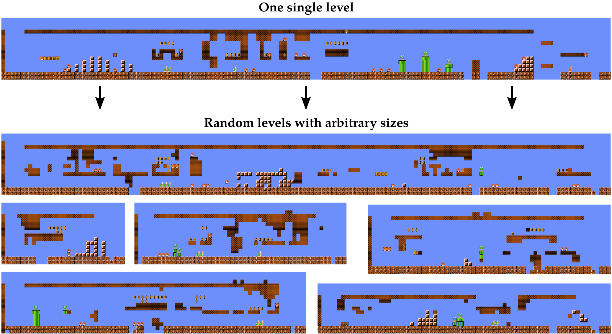

If you are using this code in your own project, please cite our paper:

```
@inproceedings{awiszus2020toadgan,
  title={TOAD-GAN: Coherent Style Level Generation from a Single Example},
  author={Awiszus, Maren and Schubert, Frederik and Rosenhahn, Bodo},
  booktitle={Proceedings of the AAAI Conference on Artificial Intelligence and Interactive Digital Entertainment},
  year={2020}
}
```

# TOAD-GAN

Official pytorch implementation of the paper: "TOAD-GAN: Coherent Style Level Generation from a Single Example"
For more information on TOAD-GAN, please refer to the paper ([arxiv](https://arxiv.org/pdf/2008.01531.pdf)).



This Project includes graphics from the game _Super Mario Bros._ **It is not affiliated with or endorsed by Nintendo.
The project was built for research purposes only.**

### AIIDE 2020

Our paper "TOAD-GAN: Coherent Style Level Generation from a Single Example" was accepted for oral presentation at [AIIDE 2020](https://webdocs.cs.ualberta.ca/~santanad/aiide/index.html)!
You can find our video presentation on [YouTube](https://youtu.be/_bnAtIYVx-s).

Our code for TOAD-GUI and TOAD-GAN has been accepted for the AIIDE 2020 Artifact Evaluation Track! 
It will be recognized in the [AIIDE 2020 Program](https://webdocs.cs.ualberta.ca/~santanad/aiide/program.html).

### TOAD-GUI

If you're interested in a demonstration of pre-trained generators, check out **[TOAD-GUI](https://github.com/Mawiszus/TOAD-GUI)**.
The GUI allows you to generate, edit and play Super Mario Bros. levels generated by TOAD-GANs.

<p align="center">

</p>

## Getting Started

This section includes the necessary steps to train TOAD-GAN on your system.

### Python

You will need [Python 3](https://www.python.org/downloads) and the packages specified in requirements.txt.
We recommend setting up a [virtual environment with pip](https://packaging.python.org/guides/installing-using-pip-and-virtual-environments/)
and installing the packages there.

**NOTE:** If you have a **GPU**, check if it is usable with [Pytorch](https://pytorch.org) and change the requirement in the file to use +gpu instead of +cpu.
Training on a GPU is significantly faster.

Install packages with:
```
$ pip3 install -r requirements.txt -f "https://download.pytorch.org/whl/torch_stable.html"
```
Make sure you use the `pip3` that belongs to your previously defined virtual environment.

## TOAD-GAN

### Training

Once all prerequisites are installed, TOAD-GAN can be trained by running `main.py`.
Make sure you are using the python installation you installed the prerequisites into.

There are several command line options available for training. These are defined in `config.py`.
An example call which will train a 3-layer TOAD-GAN on level 1-1 of _Super Mario Bros._ with 4000 iterations each scale would be:

```
$ python main.py --input-dir input --input-name lvl_1-1.txt --num_layer 3 --alpha 100 --niter 4000 --nfc 64
```

### Generating samples

If you want to use your trained TOAD-GAN to generate more samples, use `generate_samples.py`.
Make sure you define the path to a pretrained TOAD-GAN and the correct input parameters it was trained with.

```
$ python generate_samples.py  --out_ path/to/pretrained/TOAD-GAN --input-dir input --input-name lvl_1-1.txt --num_layer 3 --alpha 100 --niter 4000 --nfc 64
```

### Experiments

We supply the code for experiments made for our paper.
These files come with their own command line parameters each to control the experiment.
Check the files for more info.

#### TPKL-Divergence

```
$ python main_tile_pattern.py
```

#### Level Latent Space

```
$ python main_level_classification.py
```

#### Level Authoring

```
$ python generate_samples.py --seed_mariokart_road 
```


## Built With

* Pillow - Python Image Library for displaying images
* Pytorch - Deep Learning Framework

## Authors

* **[Maren Awiszus](https://www.tnt.uni-hannover.de/de/staff/awiszus/)** - Institut für Informationsverarbeitung, Leibniz University Hanover
* **[Frederik Schubert](https://www.tnt.uni-hannover.de/de/staff/schubert/)** - Institut für Informationsverarbeitung, Leibniz University Hanover

## Copyright

This code is not endorsed by Nintendo and is only intended for research purposes. 
Mario is a Nintendo character which the authors don’t own any rights to. 
Nintendo is also the sole owner of all the graphical assets in the game.

